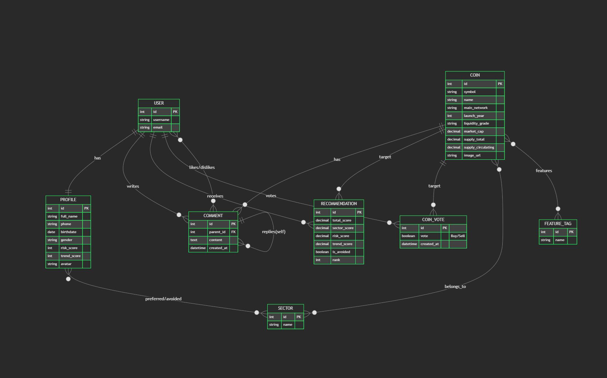

<<<<<<< HEAD
# CoinReco: 투자 성향 기반 가상자산 맞춤형 추천 및 분석 서비스 | 통합 기획서

**한 줄 정의:** 복잡한 가상자산 시장에서 당신의 투자 성향을 분석하여 최적의 포트폴리오를 제안하는 스마트 투자(Investment) 동반자

---

## 1. 문제 정의 및 시장 기회

### 1.1 가상자산 투자의 숨은 장벽

현재 가상자산 시장은 **방대한 정량적 데이터(가격, 시가총액, 거래량)**를 쏟아내고 있지만, 정작 투자자가 자신의 **내적 성향(위험 감수 능력, 트렌드 민감도, 선호 분야)**에 맞춰 최적의 자산을 선택하는 데 필요한 **정성적 가이드**는 턱없이 부족합니다.

#### 개인 차원의 검색 피로
- 수천 개의 코인 중 "나에게 맞는 코인"을 찾기 위해 커뮤니티와 뉴스레터를 수시간씩 탐독
- "하이 리스크 하이 리턴"을 원하지만 실제 어떤 코인이 그에 부합하는지 판단할 근거 부족
- 결국 **유명세나 근거 없는 추천에 의존한 묻지마 투자**로 이어짐

#### 기존 서비스의 한계
| 서비스 | 강점 | 치명적 한계 |
|--------|------|-----------|
| **CoinMarketCap / Coingecko** | 방대한 실시간 데이터 | 단순 시총 순위 나열, 개인화된 추천 기능 전무 |
| **거래소(Upbit/Binance)** | 즉각적인 거래 지원 | 정보 제공보다는 거래 유도 목적, 중립적 분석 부족 |
| **투자 커뮤니티** | 생생한 정보 공유 | 선동과 허위 정보(FUD/FOMO) 혼재, 객관적 지표 부재 |

**→ 모든 기존 서비스는 '데이터 나열'에만 집중할 뿐, "사용자의 성향(Context)"을 읽어주는 개인화 엔진이 부재합니다.**

---

## 2. 타겟 세그먼트 & 페르소나

### 2.1 핵심 타깃

| 페르소나 | 핵심 통점 | CoinReco 기대 효과 |
|---------|---------|-------------------|
| **안정 지향 투자자** | 변동성에 민감하며 우량 자산을 선호하지만, 어떤 것이 '우량'한지 판단 기준 모호 | 시가총액과 출시 연도를 분석해 "근본 코인" 위주 추천 |
| **트렌드 추구형** | 최신 유행(AI, RWA, Meme)에 민감하지만, 매번 뒷북을 치는 것에 대한 두려움 | 출시 연도와 유행 민감도를 반영한 "신규 유망주" 포착 |
| **섹터 전문가** | 특정 기술(Layer 1, DeFi 등)에 관심이 깊으나 관련 코인을 일일이 찾기 번거로움 | 선호 섹터 가중치를 적용한 정교한 필터링 및 추천 |

---

## 3. AI 및 알고리즘 특징

### 3.1 단순 필터링으로는 해결할 수 없는 영역

#### 1) 다차원 점수 산출 (Multi-dimensional Scoring)
- **알고리즘 역할:** 사용자의 위험도(1~10), 트렌드 점수(1~10), 섹터 선호도를 결합하여 **상대적 가중치 점수**를 산출.
- **Veto 로직:** 사용자가 기피하는 섹터는 추천 리스트에서 즉시 제외하여 신뢰도 확보.

#### 2) AI 기반 심층 분석 (SSAFY GMS API / GPT-4o-mini)
- **코인 리포트:** 실시간 가격 데이터와 커뮤니티 의견을 분석하여 전문가 페르소나로 리포트 생성.
- **투자 페르소나:** 사용자의 활동 데이터를 기반으로 '신중한 거북이', '굶주린 사자' 등 맞춤형 페르소나 정의 및 조언 제공.

#### 3) 비동기 성능 최적화 (Asynchronous Loading)
- 외부 API 호출로 인한 대기 시간을 최소화하기 위해 **차트, 마켓 데이터, AI 분석**을 비동기(AJAX) 방식으로 로딩하여 쾌적한 UX 제공.

---

## 4. 서비스 정체성 & 핵심 가치

### 4.1 서비스 정의
**CoinReco**는 **투자자의 성향(MBTI) + 실시간 시장 데이터(Real-time Data)**를 결합한 가상자산 큐레이션 서비스입니다.

### 4.2 핵심 가치
- **개인화 (Personalization):** 단순 추천을 넘어 '나'를 이해하는 알고리즘
- **신뢰성 (Reliability):** AI가 검증한 구체적인 데이터 근거와 리포트
- **효율성 (Efficiency):** 정보 검색에 들어가는 수시간의 노력을 1초의 추천으로 단축

---

## 5. 기능 명세 (Functional Requirements)

### 5.1 필수 기능 (Must-Have)

| ID | 기능명 | 설명 | 기술 구현 |
|----|--------|------|---------|
| **F01** | **User Auth** | 모달 기반 로그인/회원가입 및 세션 관리 | Django Auth + Hidden Reset |
| **F02** | **Investment Profile** | 투자 위험도, 유행 민감도, 선호/기피 섹터 설정 | Django Model (Profile) |
| **F03** | **Recommendation** | 성향 수치 매칭 상위 10개 자산 추천 알고리즘 | Python Scoring Logic |
| **F04** | **Real-time Market** | CoinGecko API 연동 실시간 시세 및 지표 제공 | CoinGecko API + DRF |
| **F05** | **AI Analysis** | 전문가용 코인 분석 및 프로필 페르소나 분석 | GPT-4o-mini (via GMS) |
| **F06** | **Visualization** | 고성능 캔들 차트 및 섹터 평균 변동률 시각화 | ApexCharts + AJAX |
| **F07** | **Community** | 유튜브 스타일 댓글/대댓글 및 매수/매도 투표 | CRUD + Self-referencing Model |

---

## 6. MVP 정의

### 6.1 데이터 범위
- **데이터 소스:** CoinGecko API (실시간 시세), SSAFY GMS API (AI 분석)
- **자산 규모:** 시장을 대표하는 상위 100여 개 이상의 가상자산 및 주요 섹터 데이터

---

## 7. 기술 스택 & 아키텍처

### 7.1 기술 구성
- **Backend:** Django 5.2 (Python 기반 모놀리식 아키텍처)
- **Frontend:** Django Templates + Bootstrap 5.3 + ApexCharts.js
- **Database:** SQLite3
- **External API:** CoinGecko API, SSAFY GMS API (GPT-4o-mini)
- **Security:** CSRF Protection, IsOwner Permission, Session Close Management

---

## 8. 프로젝트 일정 (WBS)

| 단계 | 대분류 | 상세 작업 | 담당자 | 기간 |
|-----|--------|-----------|--------|------|
| **1. 기획/설계** | 요구사항 분석 | 기능 명세서 작성, ERD 설계, WBS 작성 | 팀 전체 | 2025-12-22 |
| | 디자인 | UI/UX 와이어프레임 설계 | 팀 전체 | 2025-12-22 |
| **2. 데이터** | 데이터 수집 | `coins_data.csv` 완성 (201개 코인 정보) | 오재우 | 2025-12-22 |
| | 데이터 정제 | `coingecko_id` 매핑, 시총/발행량 데이터 확보 | 오재우 | 2025-12-22 |
| **3. 백엔드** | 모델 구현 | `models.py` 정의 및 DB 마이그레이션 | 최성민 | 2025-12-22 |
| | 핵심 로직 | 추천 알고리즘 개발 (위험도/유행 민감도 반영) | 최성민 | 2025-12-22 |
| | 회원 시스템 | 가입/로그인/투자 성향 설정 2단계 분리 | 최성민 | 2025-12-22 |
| | API 연동 | CoinGecko API(시세), GPT API(분석) 연동 | 최성민 | 2025-12-22 |
| **4. 프론트엔드** | 기본 레이아웃 | 네비게이션 바, 푸터, 공통 디자인 | 오재우 | 2025-12-23 |
| | 상세 페이지 | 실시간 차트 시각화, AI 코멘트 영역 디자인 | 오재우 | 2025-12-23 |
| | 커뮤니티 UI | 댓글/대댓글 입력 및 리스트 UI | 오재우 | 2025-12-23 |
| **5. 테스트/통합** | 통합 테스트 | 기능 버그 수정 및 데이터 검증 | 최성민 | 2025-12-24 ~ 2025-12-25 |
| **6. 마감** | 최종 마감 | PPT 작성 및 최종 문서 정리 | 팀 전체 | 2025-12-26 |

---

## 9. 팀 구성 & 역할 분담

| 팀원 | 직책 | 핵심 담당 | 전문성 |
|-----|------|---------|--------|
| **오재우** | BE/AI 엔지니어 (팀장) | Django API 설계, 추천 알고리즘 구현, 외부 API 통합, DB 모델링 | 로직 설계, 데이터 엔지니어링  FE/UX 엔지니어 | UI/UX 컴포넌트 개발, 데이터 시각화(ApexCharts), 비동기 최적화 | 인터페이스 설계, 사용자 경험 최적화 |

---

## 10. 기대 효과

### 10.1 정량적 효과
- **검색 시간 단축:** 수많은 코인 탐색 시간을 90% 이상 단축 (수시간 → 초 단위 추천)
- **정보 정확도 향상:** 실시간 API 연동으로 24시간 변동하는 시장 데이터 즉시 반영

### 10.2 정성적 효과
- **투자 자신감 회복:** 데이터에 기반한 근거 있는 추천으로 막연한 불안감 해소
- **합리적 투자 문화:** 감정적 매매가 아닌 '성향'과 '지표'에 기반한 투자 경험 제공

---

## 11. 데이터베이스 모델링 (ERD)

- **핵심 구조:**
    - `User` - `Profile`: 1:1 관계로 사용자의 투자 성향(위험도, 트렌드 점수 등) 관리
    - `Coin` - `Sector`/`FeatureTag`: M:N 관계로 코인의 특성 분류
    - `Comment`: 자기 참조(Self-referencing)를 통한 대댓글 구조 구현
    - `Recommendation`: 사용자별 맞춤 추천 결과 및 산출 점수 저장

---

## 12. 추천 알고리즘 기술 상세

CoinReco의 추천 엔진은 **사용자 성향 벡터**와 **코인 특성 벡터** 간의 가중치 합산 방식을 사용합니다.

1.  **데이터 정규화**: 코인의 출시 연도, 시가총액 등을 1~10 점수로 정규화합니다.
2.  **성향 매칭 점수 계산**:
    - **위험도(Risk)**: 사용자의 위험 점수와 코인의 유동성/시총 기반 위험도 간의 차이의 역수를 가중치로 사용.
    - **트렌드(Trend)**: 사용자의 트렌드 민감도와 코인의 출시 연도(신규성) 점수 매칭.
3.  **섹터 가중치**: 사용자가 선호하는 섹터에 속한 코인에는 가산점(예: +20%)을 부여하고, **기피 섹터(Avoided Sectors)에 속한 코인은 필터링 단계에서 완전히 제외(Veto)**합니다.
4.  **최종 랭킹**: 합산 점수가 높은 상위 10개 코인을 추천 테이블에 저장 및 반환합니다.

---

## 13. 생성형 AI (GPT-4o-mini) 활용 상세

본 프로젝트는 단순한 데이터 제공을 넘어 AI를 통한 **정성적 분석**을 제공합니다.

-   **코인 심층 리포트**: 
    - **입력**: 코인의 기본 정보, 실시간 시세, 최근 거래량 등.
    - **프롬프트**: "가상자산 분석가 페르소나를 가지고, 해당 코인의 기술적 가치와 현재 시장 상황을 3줄 요약해줘."
    - **결과**: 사용자에게 전문적인 투자 조언 텍스트 제공.
-   **사용자 투자 페르소나 진단**:
    - 사용자의 선호 섹터와 투표(Buy/Sell) 이력을 분석하여 '안정적인 거북이', '공격적인 사자' 등의 페르소나를 생성하고 맞춤형 격언을 제공합니다.

---

## 14. 프로젝트 회고 및 학습 내용

### 14.1 어려웠던 부분 및 해결 과정
-   **데이터 정합성 문제**: `loaddata` 시 장고 내부 모델(`contenttypes`)과의 충돌로 인한 `IntegrityError` 발생.
    -   **해결**: JSON 파일 내의 메타데이터를 정제하는 스크립트를 작성하여 해결하고, 필요한 앱 데이터만 선별적으로 로드하는 법을 학습함.
-   **비동기 차트 구현**: 실시간 데이터를 차트에 반영할 때 페이지 새로고침 없이 자연스러운 전환이 필요했음.
    -   **해결**: AJAX를 통해 백엔드 API에서 OHLC 데이터를 가져와 `ApexCharts`를 동적으로 렌더링하도록 구현.

### 14.2 새로 배운 점
-   Django의 `ManyToManyField`와 `self-referencing` 모델을 활용한 복잡한 커뮤니티 구조 설계 방법.
-   외부 API(CoinGecko) 연동 시 발생할 수 있는 Rate Limit 및 Timeout 예외 처리의 중요성.
-   생성형 AI API를 백엔드 로직에 통합하여 사용자 맞춤형 콘텐츠를 자동 생성하는 워크플로우.

---

## 15. 주요 기능 실행 화면 (Captures)

| 메인 페이지 (추천 결과) | 코인 상세 분석 (AI 리포트) |
|:---:|:---:|
|  |  |

| 섹터별 분포 | 커뮤니티 및 투표 |
|:---:|:---:|
|  |  |

*(위 이미지들은 실제 캡쳐본으로 교체 가능합니다.)*
=======
# CoinReco
>>>>>>> aa7e44074ed3a7bb9219b97a3bdbe21f06c8870e
